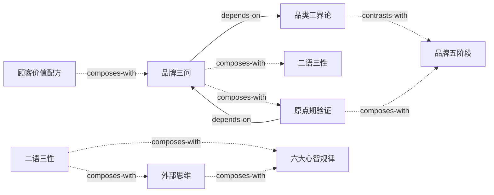

# 《升级定位25讲》 — Skill Index

> 本书由 book2skill 蒸馏，共产出 **8** 个 skills。
> 处理时间: 2026-04-18 | 阶段3完成

---

## 关于这本书

- **作者**: 冯卫东
- **出版年**: 2021
- **一句话主旨**: 品牌竞争的战场在顾客心智；品牌成功的关键是先定位（品类+特性），再通过配称建立可持续的认知优势
- **整书理解**: 见 [BOOK_OVERVIEW.md](./BOOK_OVERVIEW.md)

---

## Skill 列表（按主题分组）

### 定位基础（回答品牌是什么）

- [`brand-three-questions`](./skills/brand-three-questions/SKILL.md) — 顾客三问诊断法：品类→差异→信任状的决策框架
- [`category-three-realms`](./skills/category-three-realms/SKILL.md) — 品类真假三界论：真品类/抽象品类/伪品类的判断标准
- [`customer-value-formula`](./skills/customer-value-formula/SKILL.md) — 顾客价值配方：产品价值（内在+外在）与品牌价值（保障+彰显）

### 战略时机（判断该不该扩张）

- [`origin-period-verification`](./skills/origin-period-verification/SKILL.md) — 原点期验证：认知成果先于商业成果，指名购买是核心指标
- [`brand-five-stages`](./skills/brand-five-stages/SKILL.md) — 品牌战略五阶段：原点期→扩张期→进攻期→防御期→撤退期

### 传播表达（让定位进入顾客心智）

- [`er-yu-san-xing`](./skills/er-yu-san-xing/SKILL.md) — 二语三性法则：顾客语言×可信性×竞争性×传染性
- [`external-thinking`](./skills/external-thinking/SKILL.md) — 外部思维：信息设计从接收者认知结构出发，而非发送者意图
- [`six-mental-laws`](./skills/six-mental-laws/SKILL.md) — 六大心智规律：容量有限/追求安全/追求地位/效率法则/合作法则/学习法则

---

## 引用图



图例：
- `-->`  depends-on（前置依赖）
- `-.->`  composes-with（组合使用）
- `-..->`  contrasts-with（对照关系）

---

## 推荐学习顺序

1. **[品牌三问](skills/brand-three-questions/SKILL.md)** — 基础入口，其他所有skill的前置
2. **[品类三界论](skills/category-three-realms/SKILL.md)** — 依赖品牌三问，先判断品类真假再诊断定位
3. **[顾客价值配方](skills/customer-value-formula/SKILL.md)** — 组合品牌三问，理解"差异从哪来"
4. **[原点期验证框架](skills/origin-period-verification/SKILL.md)** — 依赖品牌三问，判断新品牌是否该扩张
5. **[品牌战略五阶段](skills/brand-five-stages/SKILL.md)** — 组合原点期判断，接在原点期验证之后
6. **[二语三性法则](skills/er-yu-san-xing/SKILL.md)** — 组合品牌三问，检验传播语言是否顾客语言
7. **[外部思维](skills/external-thinking/SKILL.md)** — 组合二语三性和六大心智规律，是传播设计的底层意识
8. **[六大心智规律](skills/six-mental-laws/SKILL.md)** — 底层原理，支撑传播表达类skill的机制解释

---

## 关系统计

| 关系类型 | 数量 |
|---|---|
| depends-on | 3 |
| contrasts-with | 1 |
| composes-with | 11 |
| **总计** | **15** |

> 经验值：8个skill，15条关系，在合理区间（8-15条）内

---

## 接入 darwin-skill

所有 skill 均带有 `test-prompts.json`（darwin-skill 兼容格式），可直接接入自动进化：

```
darwin evolve books/升级定位25讲/
```

---

## 审计轨迹

- 候选单元池: [candidates/](./candidates/)
- 被淘汰的候选（含原因）: [rejected/](./rejected/)
- BOOK_OVERVIEW: [BOOK_OVERVIEW.md](./BOOK_OVERVIEW.md)
- 阶段1.5验证记录: [verified.md](./verified.md)
